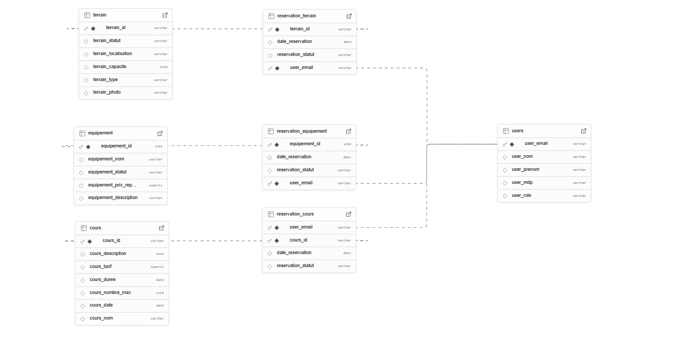

# Dossier d'Architecture - Application Mobile de Gestion pour Centre Sportif

## 1. Vue d'ensemble de l'architecture

L'application mobile du centre sportif est conçue selon une architecture moderne orientée services, avec une séparation claire entre la présentation, la logique métier et les données. Cette application est développée en utilisant React Native avec Expo pour assurer une compatibilité multiplateforme (iOS et Android) tout en maintenant une base de code unique.

L'architecture générale suit le modèle flux unidirectionnel inspiré de Redux, où les données circulent dans une seule direction, facilitant la gestion de l'état et le débogage. L'application utilise Supabase comme backend-as-a-service pour la gestion des données et l'authentification.

## 2. Structure du projet

La structure du projet est organisée de manière modulaire et suit les bonnes pratiques de développement React Native :

```
├── assets/                   # Ressources statiques (images, polices)
├── src/                      # Code source principal
│   ├── components/           # Composants réutilisables
│   │   ├── common/           # Composants communs (boutons, cartes, etc.)
│   │   ├── forms/            # Composants de formulaire
│   │   └── utils/            # Composants utilitaires
│   ├── navigation/           # Configuration de la navigation
│   │   ├── AuthStack.tsx     # Pile de navigation pour l'authentification
│   │   ├── MainStack.tsx     # Pile principale pour les utilisateurs connectés
│   │   └── MainTabs.tsx      # Navigation par onglets
│   ├── screens/              # Écrans de l'application
│   │   ├── auth/             # Écrans d'authentification
│   │   ├── reservations/     # Écrans de réservation
│   │   ├── courses/          # Écrans de gestion des cours
│   │   ├── equipment/        # Écrans de gestion des équipements
│   │   ├── profile/          # Écrans de profil utilisateur
│   │   └── admin/            # Écrans d'administration
│   ├── services/             # Services (API, gestion des données)
│   │   ├── api/              # Services d'API
│   │   ├── supabase/         # Configuration et services Supabase
│   │   └── notifications/    # Service de notifications
│   ├── store/                # État global de l'application
│   │   ├── actions/          # Actions Redux
│   │   ├── reducers/         # Réducteurs Redux
│   │   └── types/            # Types TypeScript
│   ├── hooks/                # Hooks personnalisés
│   ├── types/                # Définitions de types TypeScript
│   ├── utils/                # Fonctions utilitaires
│   └── constants/            # Constantes de l'application
├── App.tsx                   # Point d'entrée de l'application
└── app.json                  # Configuration Expo
```

## 3. Choix technologiques

### Frontend
- **React Native** : Framework JavaScript pour le développement d'applications mobiles multiplateformes
- **Expo** : Plateforme facilitant le développement, le test et le déploiement d'applications React Native
- **TypeScript** : Superset de JavaScript apportant le typage statique
- **React Navigation** : Bibliothèque de navigation pour React Native

### Backend
- **Supabase** : Alternative open source à Firebase offrant une base de données PostgreSQL, une authentification et un stockage de fichiers
- **API RESTful** : Pour les communications entre le client et le serveur

### Stockage
- **PostgreSQL** (via Supabase) : Système de gestion de base de données relationnelle robuste
- **Supabase Storage** : Pour le stockage de fichiers (images, documents)

### Notifications
- **Expo Notifications** : Pour la gestion des notifications push

### État et gestion des données
- **Redux Toolkit** : Pour la gestion de l'état global de l'application
- **React Query** : Pour la gestion des requêtes et du cache des données

## 4. Architecture des données

### Modèle de données


---



## 5. Architecture applicative

L'application est structurée en plusieurs couches :

### Couche de présentation
- **Écrans (screens)** : Composants React Native représentant les vues complètes
- **Composants (components)** : Éléments d'interface réutilisables
- **Navigation** : Gestion du routage et de la navigation entre les écrans

### Couche logique
- **Contextes et Providers** : Gestion de l'état partagé et du contexte de l'application
- **Hooks personnalisés** : Logique réutilisable pour les composants
- **Services** : Fonctionnalités transverses (authentification, notifications)

### Couche d'accès aux données
- **API Services** : Communication avec les services backend
- **Supabase Client** : Interface avec Supabase pour les opérations CRUD
- **Store** : Gestion de l'état global avec Redux ou Context API

### Architecture des composants clés

#### Système d'authentification
L'authentification repose sur Supabase Auth et utilise un contexte React (AuthProvider) qui expose les méthodes d'authentification et l'état de connexion à tous les composants.

#### Système de réservation
Le système de réservation utilise une architecture en flux pour gérer le parcours de réservation :
1. Sélection du type de réservation (terrain, cours, équipement)
2. Sélection de la date et du créneau horaire
3. Configuration des options additionnelles
4. Confirmation et paiement

#### Système de notification
Les notifications sont gérées par Expo Notifications et un service dédié qui :
- S'enregistre pour les notifications push
- Gère les tokens d'appareil
- Traite les notifications entrantes
- Programme les rappels de réservation

## 6. Flux de données et interactions

### Authentification
```
┌───────────┐     ┌───────────┐     ┌───────────┐     ┌───────────┐
│  Écran de │     │AuthProvider│    │ Supabase  │     │  Base de  │
│ connexion │     │           │     │   Auth    │     │  données  │
└─────┬─────┘     └─────┬─────┘     └─────┬─────┘     └─────┬─────┘
      │                 │                 │                 │
      │ Soumission des  │                 │                 │
      │ identifiants    │                 │                 │
      │────────────────>│                 │                 │
      │                 │ Demande         │                 │
      │                 │ d'authentification                │
      │                 │────────────────>│                 │
      │                 │                 │ Vérification    │
      │                 │                 │ des identifiants│
      │                 │                 │────────────────>│
      │                 │                 │                 │
      │                 │                 │  Réponse        │
      │                 │                 │<────────────────│
      │                 │ Réponse (token) │                 │
      │                 │<────────────────│                 │
      │ Mise à jour de  │                 │                 │
      │ l'état et       │                 │                 │
      │ redirection     │                 │                 │
      │<────────────────│                 │                 │
      │                 │                 │                 │
```

### Réservation d'un terrain
```
┌───────────┐     ┌───────────┐     ┌───────────┐     ┌───────────┐
│  Écran de │     │ Service de│     │ Service   │     │  Base de  │
│réservation│     │réservation│     │  d'API    │     │  données  │
└─────┬─────┘     └─────┬─────┘     └─────┬─────┘     └─────┬─────┘
      │                 │                 │                 │
      │ Sélection du    │                 │                 │
      │ terrain/date    │                 │                 │
      │────────────────>│                 │                 │
      │                 │ Vérification    │                 │
      │                 │ disponibilité   │                 │
      │                 │────────────────>│                 │
      │                 │                 │ Requête de      │
      │                 │                 │ disponibilité   │
      │                 │                 │────────────────>│
      │                 │                 │                 │
      │                 │                 │  Réponse        │
      │                 │                 │<────────────────│
      │                 │ Réponse         │                 │
      │                 │<────────────────│                 │
      │ Affichage des   │                 │                 │
      │ créneaux        │                 │                 │
      │<────────────────│                 │                 │
      │                 │                 │                 │
      │ Confirmation de │                 │                 │
      │ réservation     │                 │                 │
      │────────────────>│                 │                 │
      │                 │ Création de     │                 │
      │                 │ la réservation  │                 │
      │                 │────────────────>│                 │
      │                 │                 │ Enregistrement  │
      │                 │                 │ de la réservation│
      │                 │                 │────────────────>│
      │                 │                 │                 │
      │                 │                 │  Confirmation   │
      │                 │                 │<────────────────│
      │                 │ Confirmation    │                 │
      │                 │<────────────────│                 │
      │ Notification de │                 │                 │
      │ succès          │                 │                 │
      │<────────────────│                 │                 │
      │                 │                 │                 │
```

## 7. Sécurité

### Authentification et autorisation
- Utilisation de JWT (JSON Web Tokens) pour l'authentification via Supabase
- Validation côté serveur des permissions pour chaque requête
- Stockage sécurisé des tokens d'authentification avec AsyncStorage
- Temps d'expiration des sessions et mécanisme de rafraîchissement des tokens

### Sécurisation des données
- Validation des entrées utilisateur côté client et serveur
- Utilisation de requêtes paramétrées pour prévenir les injections SQL
- Chiffrement des données sensibles dans la base de données
- HTTPS pour toutes les communications client-serveur

### Protection de la vie privée
- Conformité au RGPD pour la collecte et le stockage des données personnelles
- Politique de confidentialité claire et accessible
- Fonctionnalités permettant aux utilisateurs de supprimer leurs données

## 8. Performances et évolutivité

### Optimisations de performances
- Utilisation de listes virtualisées pour afficher de grandes quantités de données
- Mise en cache des données fréquemment utilisées
- Lazy loading des composants et écrans
- Compression des images et ressources statiques

### Évolutivité
- Architecture modulaire permettant l'ajout de nouvelles fonctionnalités
- Séparation claire des préoccupations (SoC) facilitant la maintenance
- Utilisation de services backend évolutifs (Supabase)
- CI/CD pour les déploiements réguliers et tests automatisés

### Monitoring et analyse
- Intégration d'outils de suivi des performances (Firebase Performance Monitoring)
- Suivi des crashs et erreurs avec Sentry
- Analyse du comportement utilisateur avec Analytics
- Tableaux de bord pour surveiller l'utilisation des ressources côté serveur

## 9. Conformité et accessibilité

### Accessibilité
- Conformité aux directives WCAG 2.1
- Support des fonctionnalités d'accessibilité natives (VoiceOver, TalkBack)
- Contraste de couleurs adéquat et tailles de texte ajustables

### Internationalisation
- Architecture supportant la multi-langue via i18n
- Structure adaptable aux différentes conventions régionales (dates, nombres, etc.)

---

Cette architecture est conçue pour être robuste, évolutive et maintenable, tout en offrant une expérience utilisateur de qualité. Elle s'appuie sur les meilleures pratiques du développement mobile moderne et exploite les forces de React Native et Expo pour livrer une application performante sur toutes les plateformes.
